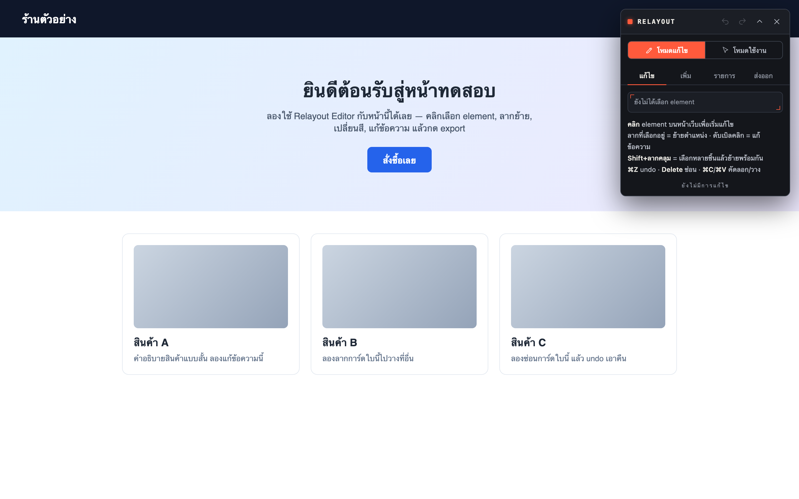
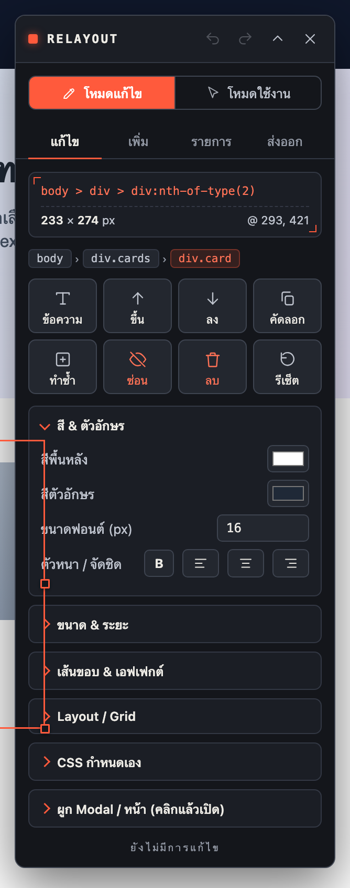
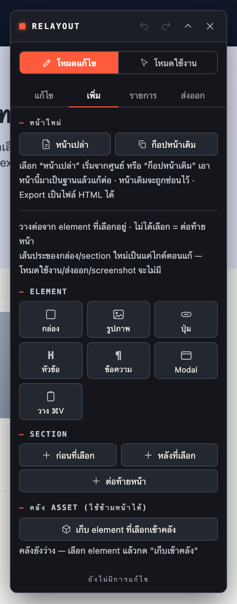
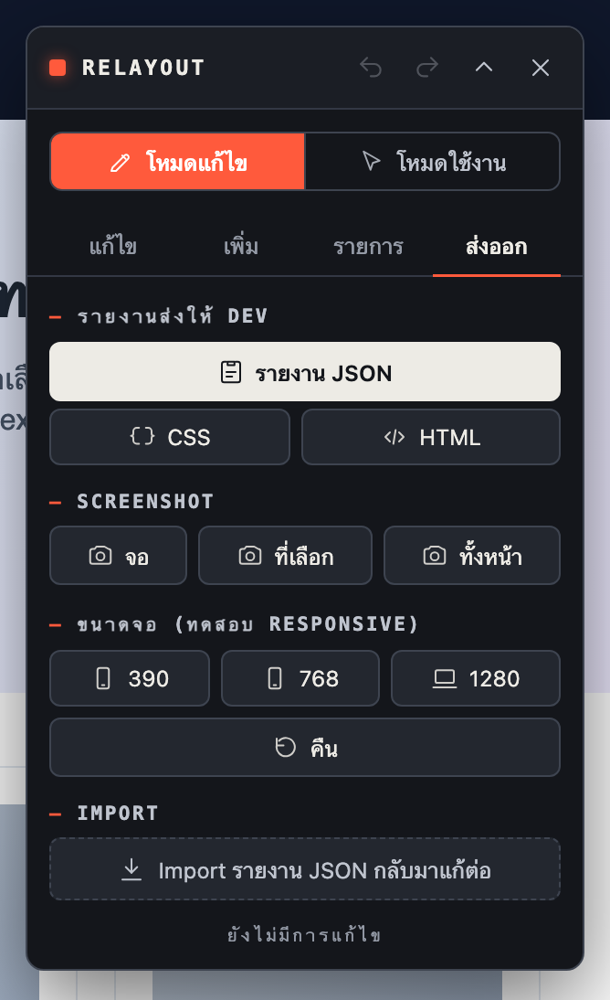
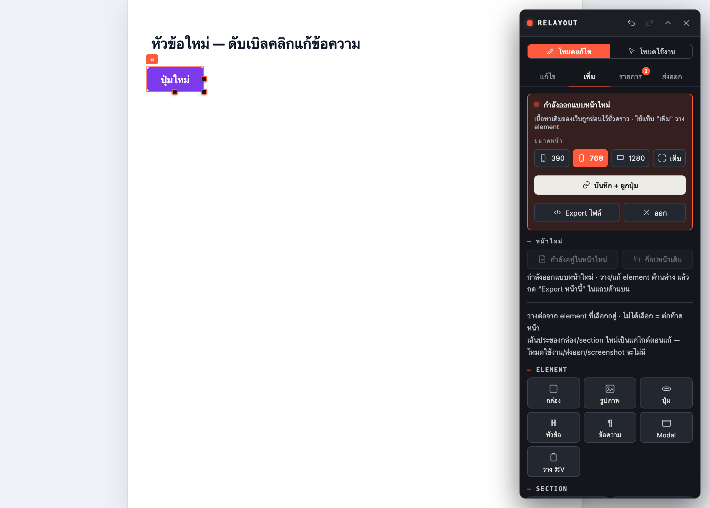
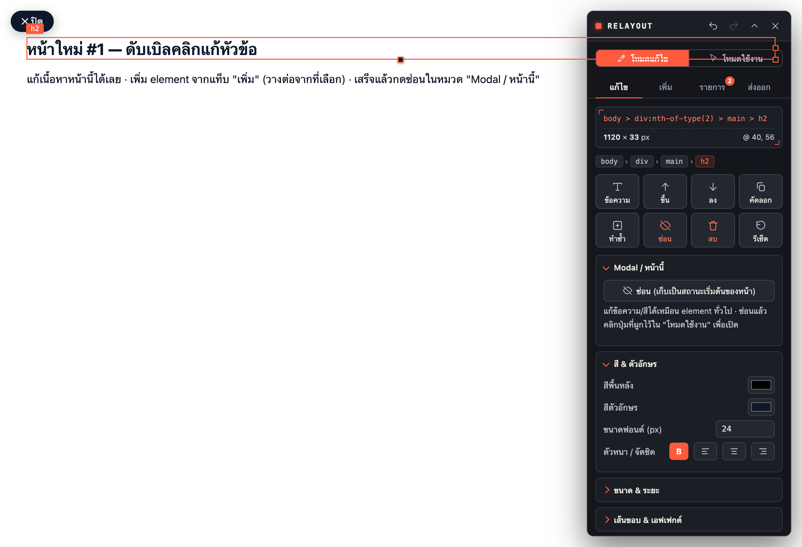
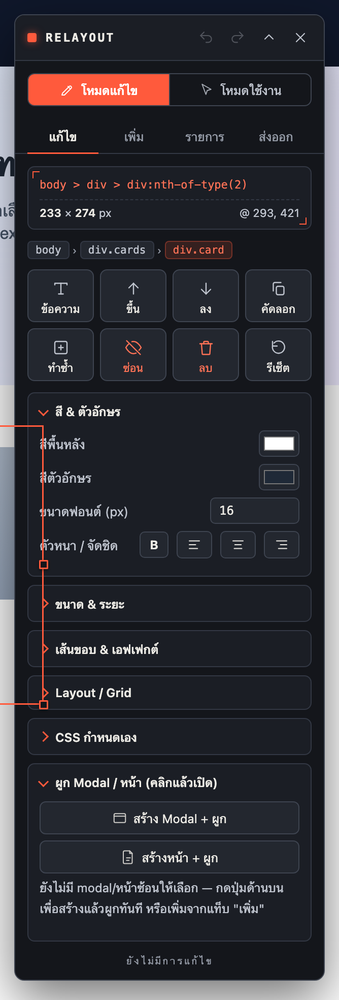
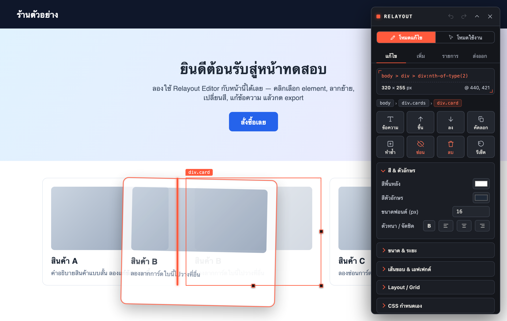
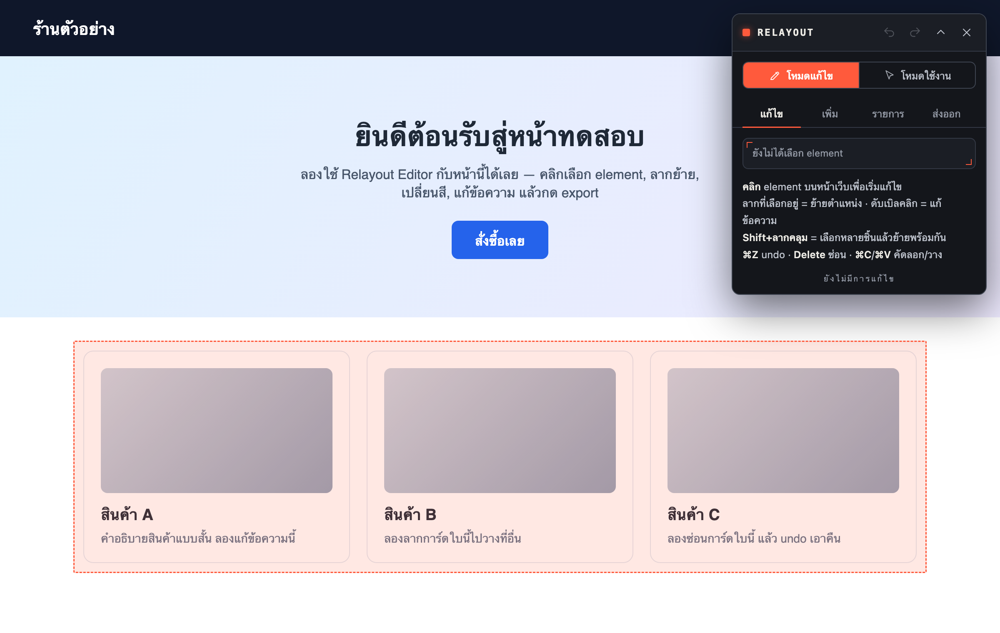

# Relayout Editor

> Chrome Extension สำหรับทีม UI/UX — เปิดหน้าเว็บจริงแล้วแก้ layout ได้ทันที
> ลากย้ายเป็น block · ปรับขนาด · เปลี่ยนสี · เปลี่ยนรูป · แก้ข้อความ · เพิ่ม element / modal · **ออกแบบหน้าใหม่ทั้งหน้า**
> งานบันทึกอัตโนมัติข้าม refresh แล้ว **export** เป็นรายงาน / CSS / HTML / ภาพ ส่งให้ dev หรือ AI ทำต่อได้เลย

Panel ทั้งหมดอยู่ใน **Shadow DOM** จึงไม่ชนสไตล์ของหน้าเว็บ และไม่มีร่องรอยติดไปตอน export · หน้าตาเป็นชุดเครื่องมือแบบ *graphite instrument* — พื้นกราไฟต์ ตัวอักษรอ่านง่าย ไอคอนเส้นชุดเดียวกัน และใช้สีแดง (redline) เน้นเฉพาะสิ่งที่เลือก/ลบ/mark บนหน้า

---

## วิธีติดตั้ง

1. เปิด Chrome ไปที่ `chrome://extensions`
2. เปิดสวิตช์ **Developer mode** (มุมขวาบน)
3. กด **Load unpacked** แล้วเลือกโฟลเดอร์นี้ (`ex-relayout`)
4. ปักหมุดไอคอน Relayout Editor ไว้ที่ toolbar

> อยากลองก่อน? เปิด `test-page.html` (`open test-page.html`) แล้วคลิกไอคอน extension ได้เลย
>
> **แก้ไฟล์แล้ว panel ไม่ขึ้น?** หลังแก้โค้ดต้องกด reload (⟳) ที่ `chrome://extensions` **แล้ว reload หน้าเว็บ (F5)** ด้วย ไม่งั้น content script ตัวเก่าจะยังค้างอยู่

---

## เริ่มใช้งาน

เปิดหน้าเว็บที่ต้องการแก้ แล้ว **คลิกไอคอน extension** → panel จะโผล่ขวาบน

- คลิกไอคอนซ้ำ = ปิด
- ปุ่ม **^** (chevron) = ย่อ panel เหลือแค่แถบหัว
- **ลากแถบหัว** = ย้ายตำแหน่ง panel

### 2 โหมดการทำงาน (สวิตช์บนสุดของ panel)

| โหมด | ทำอะไร |
|---|---|
| **โหมดแก้ไข** | cursor เป็น crosshair · คลิก = เลือก element (ค่าเริ่มต้น) |
| **โหมดใช้งาน** | cursor ปกติ · คลิกลิงก์/ปุ่ม/ฟอร์มของหน้าได้จริง — ไว้ทดลอง flow (เช่นคลิกปุ่มที่ผูก modal/หน้าไว้) โดยงานที่แก้ค้างไว้ไม่หาย · กรอบเลือกของโหมดแก้ไขจะหายไปให้เห็นหน้าจริงล้วน ๆ |

---

## Panel แบ่งเป็น 4 แท็บ

คลิกเลือก element บนหน้าเมื่อไหร่ panel จะพากลับมาแท็บ **แก้ไข** ให้อัตโนมัติ

### แก้ไข

บนสุดเป็น **caliper readout** — อ่านค่า element ที่เลือกแบบเครื่องมือวัด: selector + ขนาด `กว้าง × สูง px` + ตำแหน่ง `@ x, y` (อัปเดตสดตามหน้าจอ) · ถัดมาเป็น breadcrumb (ไต่ขึ้นหา element แม่ทีละชั้น), แถวปุ่มจัดการ และ inspector แบบหมวดพับได้

| ปุ่ม / หมวด | ทำอะไร |
|---|---|
| ข้อความ · ขึ้น/ลง · คัดลอก · ทำซ้ำ · ซ่อน · ลบ · รีเซ็ต | แถวปุ่มจัดการ element |
| **สี & ตัวอักษร** | สีพื้น / สีตัวอักษร / ฟอนต์ / ตัวหนา / จัดชิด |
| **ขนาด & ระยะ** | กว้าง / สูง / padding / margin แยก 4 ด้าน |
| **เส้นขอบ & เอฟเฟกต์** | มุมโค้ง / เส้นขอบ / เงา / ความทึบ |
| **Layout / Grid** | Block / Flex แถว / Flex คอลัมน์ / **Grid** + จำนวนคอลัมน์ + gap |
| **CSS กำหนดเอง** | พิมพ์ CSS ตรง ๆ (`prop: value;` หลายบรรทัด) กดใช้ — ตรวจ syntax + undo ได้ทั้งชุด |
| **ผูก Modal / หน้า** | สร้าง modal/หน้า แล้วผูกให้คลิกเปิด (ดูหัวข้อด้านล่าง) |

> เลือกช่องตาราง (th/td) หรือรูป `` จะมีหมวด **คอลัมน์ตาราง** / **รูปภาพ** โผล่ให้เอง

### เพิ่ม

เพิ่มของใหม่ — ทุกอย่างวางต่อจาก element ที่เลือก (ไม่ได้เลือก = ต่อท้ายหน้า) แล้วแก้/ลาก/ลบต่อได้เหมือน element ทั่วไป

- บนสุด: **หน้าใหม่** — เริ่มออกแบบหน้าเปล่า หรือก็อปหน้าเดิมมาเป็นฐาน (ดูหัวข้อด้านล่าง)
- **กล่อง** เปล่า · **รูปภาพ** placeholder · **ปุ่ม** · **หัวข้อ** (H) · **ข้อความ** (¶) · **Modal**
- **วาง ⌘V** — วางของที่คัดลอกไว้
- **Section** ก่อน/หลังที่เลือก หรือต่อท้ายหน้า
- **คลัง Asset** — เก็บ element ไว้ใช้ข้ามหน้า/ข้ามเว็บ

> **เส้นประรอบกล่อง/section ใหม่เป็นแค่ไกด์ตอนแก้** — สลับโหมดใช้งาน, ถ่าย screenshot, หรือ export เมื่อไหร่จะไม่มีเส้นประติดไป ไม่ต้องลบเอง

### รายการ

รายการแก้ไขทั้งหมด (มี **badge** นับจำนวนบนแท็บ) — คลิกชื่อเพื่อกระโดดไปดู element, กดรีเซ็ตรายตัว หรือรีเซ็ตทั้งหน้า

### ส่งออก

- **รายงาน JSON** — ทุกการแก้ไข: selector, สไตล์ `from → to`, ข้อความ/รูป, ตำแหน่งใหม่, ซ่อน/ลบ, element ที่เพิ่ม (พร้อม HTML + `kind: element/modal/page-overlay`), การผูก (`opensKind`), และหน้าใหม่ที่ค้างอยู่ (`newPageDraft`)
- **CSS** — สไตล์ที่แก้เป็น `selector { prop: value }` ก็อปวางได้เลย
- **HTML** — snapshot ทั้งหน้าหลังแก้ (ถ้าอยู่ในโหมดหน้าใหม่ = ได้ไฟล์หน้าใหม่แบบ standalone)
- **จอ / ที่เลือก / ทั้งหน้า** — ภาพ PNG (viewport ปัจจุบัน / เฉพาะ element / ทั้งหน้าแบบต่อภาพ)
- **390 / 768 / 1280** — ปรับ viewport ของหน้าต่างจริง ทดสอบ responsive (media query ทำงานจริง) · คืนเดิม
- **Import JSON** — โหลดรายงานกลับมาแก้ต่อ/รีวิวบนหน้าจริง (กู้คืนได้ทั้งการผูก modal/หน้า และหน้าใหม่ที่ค้าง)

> **รายงานคือตัวส่งมอบ** — เป้าหมายของ extension นี้คือให้ผลลัพธ์ที่ export ไปสั่งงาน dev/AI ต่อได้ครบ ทุก field จึง round-trip ได้ (export → import กลับมาเหมือนเดิม)

---

## ออกแบบหน้าใหม่ทั้งหน้า

ที่แท็บ **เพิ่ม → หน้าใหม่** เลือกได้ 2 แบบ:

- **หน้าเปล่า** — ซ่อนเนื้อหาเดิมของเว็บ ให้ canvas ว่างมาออกแบบตั้งแต่ต้น
- **ก็อปหน้าเดิม** — ก็อปหน้าปัจจุบันมาเป็นฐาน (สไตล์เดิมครบ) แล้วแก้ต่อ

จากนั้นวาง element ด้วยเครื่องมือในแท็บ "เพิ่ม" ได้ตามปกติ · แถบด้านบนมี:

- **ขนาดหน้า** — 390 (มือถือ) / 768 (แท็บเล็ต) / 1280 (เดสก์ท็อป) / เต็ม — สลับได้สดๆ เห็นขอบ artboard บนพื้นเทา
- **บันทึก + ผูกปุ่ม** — เก็บหน้าใหม่เป็น "หน้าซ้อน" ฝังในหน้าปัจจุบัน แล้วผูกกับปุ่มได้ (ดูหัวข้อถัดไป)
- **Export ไฟล์** — ดาวน์โหลดเป็น HTML หน้าใหม่แบบ standalone
- **ออก** — คืนเนื้อหาเดิมของเว็บกลับมา

---

## ผูก Modal / หน้า กับปุ่ม (คลิกแล้วเปิด)

**วิธีเร็วสุด — ในแท็บแก้ไข:** คลิกเลือกปุ่ม/element → เปิดหมวด **"ผูก Modal / หน้า"** → กด **สร้าง Modal + ผูก** หรือ **สร้างหน้า + ผูก** → modal/หน้าถูกสร้าง ผูกกับปุ่มนั้น และเปิดค้างให้แก้เนื้อหาต่อทันที เสร็จแล้วกด **ซ่อน** (หมวด "Modal / หน้านี้")

**วิธีอื่น:** สร้าง modal จากแท็บ "เพิ่ม" หรือบันทึกหน้าใหม่เป็นหน้าซ้อน → แล้วเลือกปุ่ม → เลือกปลายทางจาก dropdown (แสดงเป็น "modal · …" หรือ "หน้า · …") → กดผูก

- **modal** = กล่องลอยกลางจอ · **หน้า** = overlay เต็มจอ (มีปุ่ม ✕ ปิดมุมซ้าย)
- สลับ **โหมดใช้งาน** แล้วคลิกปุ่มนั้น → เปิดจริง

> การผูกฝังเป็น inline `onclick` + attribute `data-rl-opens-modal` → **HTML ที่ export ไปคลิกเปิดได้จริง** โดยไม่ต้องพึ่ง extension · undo / ยกเลิกผูก / reset ได้

---

## การใช้งานที่ควรรู้

### ลากย้ายเป็น block

เลือก element แล้ว **ลาก** — ตัว element ลอยตามเมาส์ (ghost)

- **เส้นแดง** = แทรกก่อน/หลัง element นั้น
- **กรอบแดงเส้นประ** (ลากไปกลาง container) = ยัดเข้าไปข้างในกล่อง/section

### เลือกหลายชิ้นพร้อมกัน (คลุมดำ)

- **Shift + ลากคลุม** — เลือกทุก element ที่อยู่ในกรอบทั้งตัว
- **Shift + คลิก** — เพิ่ม/เอาออกทีละชิ้น
- **ลากชิ้นไหนก็ได้ในกลุ่ม** = ย้ายทั้งกลุ่มพร้อมกัน (ลำดับคงเดิม, undo เดียว)
- **Delete** = ซ่อนทั้งกลุ่ม · **Esc** = ยกเลิกกลุ่ม

### คีย์ลัด

| คีย์ | ทำอะไร |
|---|---|
| **⌘Z** / **⇧⌘Z** | Undo / Redo |
| **⌘C** / **⌘V** | คัดลอก / วาง (วางซ้ำได้หลายครั้ง) |
| **Delete** | ซ่อน element (รายงานบอก dev ว่า "ซ่อนไว้") |
| **Shift+Delete** | ลบจริง (รายงานบอกว่า "เอาออกเลย") |
| **ดับเบิลคลิก** | แก้ข้อความ (เสร็จแล้วกด Esc) |
| **Esc** | ออกจากแก้ข้อความ / ยกเลิกกลุ่มที่เลือก |

### คลัง Asset (ใช้ข้ามหน้า / ข้ามเว็บ)

- เลือก element แล้วกด **เก็บเข้าคลัง** (ตั้งชื่อได้) — ระบบอบ computed styles ลง inline ให้ จึงหน้าตาใกล้เคียงเดิมแม้วางบนหน้าที่ไม่มี CSS ต้นทาง
- คลังอยู่ใน `chrome.storage` → เปิด editor บน**หน้าไหนก็ได้**แล้ววางลงหน้านั้น (เก็บล่าสุด 30 ชิ้น)

### บันทึกอัตโนมัติ + งานต่อเนื่อง

- ทุกการแก้ไขเซฟลง `chrome.storage` ต่อ URL — refresh แล้วเปิด editor ใหม่จะมีแถบ **"พบงานที่ค้างไว้ → กู้คืน/ทิ้ง"** (รวมหน้าใหม่ที่ออกแบบค้างไว้)
- ถ้าหน้าเป็น SPA แล้ว framework render ทับของที่แก้ จะมี toast เตือน (กู้คืนจาก storage หรือ import ได้)

---

## โครงสร้างไฟล์

| ไฟล์ | หน้าที่ |
|---|---|
| `manifest.json` | Manifest V3, สิทธิ์ `activeTab` + `scripting` + `storage` |
| `background.js` | service worker: inject editor, ถ่าย screenshot, ปรับขนาดหน้าต่าง (responsive) |
| `editor.js` | ตัว editor ทั้งหมด (UI + ไอคอน SVG + logic อยู่ใน Shadow DOM) |
| `test-page.html` | หน้าตัวอย่างไว้ลองเล่น |
| `docs/` | ภาพประกอบใน README |

---

## ข้อจำกัด

- ใช้กับหน้า `chrome://`, Chrome Web Store, หรือ PDF viewer ไม่ได้ (Chrome ห้าม inject)
- การกู้คืน/Import อ้าง element ด้วย CSS selector — ถ้าโครงหน้าเปลี่ยนไปมาก บางรายการอาจหา element ไม่เจอ (จะแจ้งจำนวนที่พลาด)
- Screenshot ทั้งหน้า: ส่วนที่เป็น `position: fixed` (header ลอย) จะติดซ้ำในแต่ละช่วงภาพ
