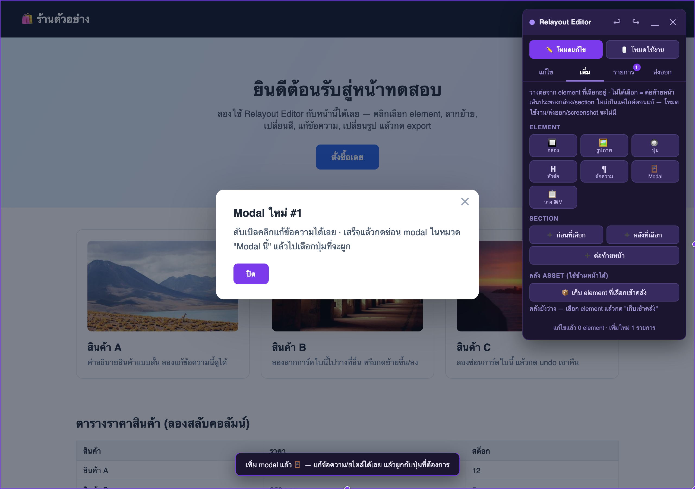

# Relayout Editor 🎨

> Chrome Extension สำหรับทีม UI/UX — เปิดหน้าเว็บจริงแล้วแก้ layout ได้ทันที
> ลากย้ายเป็น block · ปรับขนาด · เปลี่ยนสี · เปลี่ยนรูป · แก้ข้อความ · เพิ่ม element / modal ใหม่
> งานบันทึกอัตโนมัติข้าม refresh แล้ว **export** เป็นรายงาน / CSS / HTML / ภาพ ส่งให้ dev ได้เลย

Panel ทั้งหมดอยู่ใน **Shadow DOM** จึงไม่ชนสไตล์ของหน้าเว็บ และไม่มีร่องรอยติดไปตอน export

---

## วิธีติดตั้ง

1. เปิด Chrome ไปที่ `chrome://extensions`
2. เปิดสวิตช์ **Developer mode** (มุมขวาบน)
3. กด **Load unpacked** แล้วเลือกโฟลเดอร์นี้ (`ex-relayout`)
4. ปักหมุดไอคอน Relayout Editor ไว้ที่ toolbar

> อยากลองก่อน? เปิด `test-page.html` (`open test-page.html`) แล้วคลิกไอคอน extension ได้เลย

---

## เริ่มใช้งาน

เปิดหน้าเว็บที่ต้องการแก้ แล้ว **คลิกไอคอน extension** → panel จะโผล่ขวาบน

- คลิกไอคอนซ้ำ = ปิด
- ปุ่ม **▁** = ย่อ panel เหลือแค่แถบหัว
- **ลากแถบหัว** = ย้ายตำแหน่ง panel

### 2 โหมดการทำงาน (สวิตช์บนสุดของ panel)

| โหมด | ทำอะไร |
|---|---|
| **✏️ โหมดแก้ไข** | cursor เป็น crosshair · คลิก = เลือก element (ค่าเริ่มต้น) |
| **🖱 โหมดใช้งาน** | cursor ปกติ · คลิกลิงก์/ปุ่ม/ฟอร์มของหน้าได้จริง — ไว้ทดลอง flow ระหว่างแก้ โดยงานที่แก้ค้างไว้ไม่หาย |

---

## Panel แบ่งเป็น 4 แท็บ

คลิกเลือก element บนหน้าเมื่อไหร่ panel จะพากลับมาแท็บ **แก้ไข** ให้อัตโนมัติ

### 🖊️ แก้ไข

selector + breadcrumb (ไต่ขึ้นหา element แม่ได้ทีละชั้น), แถวปุ่มจัดการ และ inspector แบบหมวดพับได้

| ปุ่ม / หมวด | ทำอะไร |
|---|---|
| ✏️ ข้อความ · ⬆︎/⬇︎ ขึ้น-ลง · 📄 คัดลอก · ⧉ ทำซ้ำ · 🙈 ซ่อน · 🗑 ลบ · ♻️ รีเซ็ต | แถวปุ่มจัดการ element |
| **สี & ตัวอักษร** | สีพื้น / สีตัวอักษร / ฟอนต์ / ตัวหนา / จัดชิด |
| **ขนาด & ระยะ** | กว้าง / สูง / padding / margin แยก 4 ด้าน |
| **เส้นขอบ & เอฟเฟกต์** | มุมโค้ง / เส้นขอบ / เงา / ความทึบ |
| **Layout / Grid** | Block / Flex แถว / Flex คอลัมน์ / **Grid** + จำนวนคอลัมน์ + gap |
| **CSS กำหนดเอง** | พิมพ์ CSS ตรง ๆ (`prop: value;` หลายบรรทัด) กด ✨ ใช้ — ตรวจ syntax + undo ได้ทั้งชุด |
| **ผูก Modal** | เลือก modal ที่จะเปิดเมื่อคลิก element นี้ (ดูหัวข้อ Modal ด้านล่าง) |

> เลือกช่องตาราง (th/td) หรือรูป `` จะมีหมวด **คอลัมน์ตาราง** / **รูปภาพ** โผล่ให้เอง

### ➕ เพิ่ม

เพิ่มของใหม่ — ทุกอย่างวางต่อจาก element ที่เลือก (ไม่ได้เลือก = ต่อท้ายหน้า) แล้วแก้/ลาก/ลบต่อได้เหมือน element ทั่วไป

- 🔲 **กล่อง** เปล่า (ลาก element อื่นยัดเข้าไปได้) · 🖼️ **รูปภาพ** placeholder · 🔘 **ปุ่ม** · 𝗛 **หัวข้อ** · ¶ **ข้อความ** · 🪟 **Modal**
- 📋 **วาง ⌘V** — วางของที่คัดลอกไว้
- ➕ **Section** ก่อน/หลังที่เลือก หรือต่อท้ายหน้า
- 📦 **คลัง Asset** — เก็บ element ไว้ใช้ข้ามหน้า/ข้ามเว็บ

> **เส้นประรอบกล่อง/section ใหม่เป็นแค่ไกด์ตอนแก้** — สลับเป็นโหมดใช้งาน, ถ่าย screenshot, หรือ export เมื่อไหร่จะไม่มีเส้นประติดไปด้วย ไม่ต้องลบเอง

### 📋 รายการ

รายการแก้ไขทั้งหมด (มี **badge** นับจำนวนบนแท็บ) — คลิกชื่อเพื่อกระโดดไปดู element, กด ♻️ รีเซ็ตรายตัว หรือรีเซ็ตทั้งหน้า

### 📤 ส่งออก

- **📋 รายงาน JSON** — ทุกการแก้ไข: selector, สไตล์ `from → to`, ข้อความ/รูป, ตำแหน่งใหม่, ซ่อน/ลบ, element ที่เพิ่ม (พร้อม HTML), การผูก modal
- **🎨 CSS** — สไตล์ที่แก้เป็น `selector { prop: value }` ก็อปวางได้เลย
- **🧾 HTML** — snapshot ทั้งหน้าหลังแก้
- **📸 จอ / ที่เลือก / ทั้งหน้า** — ภาพ PNG (viewport ปัจจุบัน / เฉพาะ element / ทั้งหน้าแบบต่อภาพ ~8000px)
- **📱 390 / 768 / 💻 1280** — ปรับ viewport ทดสอบ responsive (media query ทำงานจริง) · ↩︎ คืนเดิม
- **📥 Import JSON** — โหลดรายงานกลับมาแก้ต่อ/รีวิวบนหน้าจริง

---

## การใช้งานที่ควรรู้

### ลากย้ายเป็น block

เลือก element แล้ว **ลาก** — ตัว element ลอยตามเมาส์

- **เส้นม่วง** = แทรกก่อน/หลัง element นั้น
- **กรอบม่วงเส้นประ** (ลากไปกลาง container) = ยัดเข้าไปข้างในกล่อง/section

### เลือกหลายชิ้นพร้อมกัน (คลุมดำ)

- **Shift + ลากคลุม** — เลือกทุก element ที่อยู่ในกรอบทั้งตัว
- **Shift + คลิก** — เพิ่ม/เอาออกทีละชิ้น
- **ลากชิ้นไหนก็ได้ในกลุ่ม** = ย้ายทั้งกลุ่มพร้อมกัน (ลำดับคงเดิม, undo เดียว)
- **Delete** = ซ่อนทั้งกลุ่ม · **Esc** = ยกเลิกกลุ่ม

### เพิ่ม Modal + ผูกกับปุ่ม

1. กด 🪟 **Modal** ที่แท็บ **เพิ่ม** → แก้ข้อความ/สีตามต้องการ
2. กด **🙈 ซ่อน modal** (หมวด "Modal นี้") ให้กลับไปสถานะเริ่มต้นของหน้า
3. คลิกเลือก **ปุ่ม/element ไหนก็ได้** → หมวด **"ผูก Modal (คลิกแล้วเปิด)"** → เลือก modal → **🔗 ผูก**
4. สลับ **โหมดใช้งาน** แล้วคลิกปุ่มนั้น → modal เปิดจริง (ปุ่ม ✕ / ปิด / คลิกฉากหลัง = ปิด)

> การผูกฝังเป็น inline `onclick` + attribute `data-rl-opens-modal` → **HTML ที่ export ไปคลิกเปิดได้จริง** โดยไม่ต้องพึ่ง extension, undo / ยกเลิกผูก / reset ได้ (ปุ่ม 👁 = เปิด modal ขึ้นมาแก้อีกครั้ง)

### คีย์ลัด

| คีย์ | ทำอะไร |
|---|---|
| **⌘Z** / **⇧⌘Z** | Undo / Redo |
| **⌘C** / **⌘V** | คัดลอก / วาง (วางซ้ำได้หลายครั้ง) |
| **Delete** | ซ่อน element (รายงานบอก dev ว่า "ซ่อนไว้") |
| **Shift+Delete** | ลบจริง (รายงานบอกว่า "เอาออกเลย") |
| **ดับเบิลคลิก** | แก้ข้อความ (เสร็จแล้วกด Esc) |
| **Esc** | ออกจากแก้ข้อความ / ยกเลิกกลุ่มที่เลือก |

### คลัง Asset (ใช้ข้ามหน้า / ข้ามเว็บ)

- เลือก element แล้วกด **📦 เก็บเข้าคลัง** (ตั้งชื่อได้) — ระบบอบ computed styles ลง inline ให้ จึงหน้าตาใกล้เคียงเดิมแม้วางบนหน้าที่ไม่มี CSS ของหน้าต้นทาง
- คลังอยู่ใน `chrome.storage` ของ extension → เปิด editor บน**หน้าไหนก็ได้**แล้วกด 📌 วางลงหน้านั้น (เก็บล่าสุด 30 ชิ้น)

### บันทึกอัตโนมัติ + งานต่อเนื่อง

- ทุกการแก้ไขเซฟลง `chrome.storage` ต่อ URL — refresh แล้วเปิด editor ใหม่จะมีแถบ **"พบงานที่ค้างไว้ → กู้คืน/ทิ้ง"**
- ถ้าหน้าเป็น SPA แล้ว framework render ทับของที่แก้ จะมี toast เตือน (กู้คืนจาก storage หรือ import ได้)

---

## โครงสร้างไฟล์

| ไฟล์ | หน้าที่ |
|---|---|
| `manifest.json` | Manifest V3, สิทธิ์ `activeTab` + `scripting` + `storage` |
| `background.js` | service worker: inject editor, ถ่าย screenshot, ปรับขนาดหน้าต่าง (responsive) |
| `editor.js` | ตัว editor ทั้งหมด (UI อยู่ใน Shadow DOM) |
| `test-page.html` | หน้าตัวอย่างไว้ลองเล่น |
| `docs/` | ภาพประกอบใน README |

---

## ข้อจำกัด

- ใช้กับหน้า `chrome://`, Chrome Web Store, หรือ PDF viewer ไม่ได้ (Chrome ห้าม inject)
- การกู้คืน/Import อ้าง element ด้วย CSS selector — ถ้าโครงหน้าเปลี่ยนไปมาก บางรายการอาจหา element ไม่เจอ (จะแจ้งจำนวนที่พลาด)
- Screenshot ทั้งหน้า: ส่วนที่เป็น `position: fixed` (header ลอย) จะติดซ้ำในแต่ละช่วงภาพ
